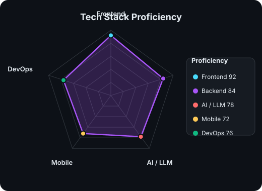

<div align="center">
  
</div>

<div align="center">
  
</div>

---

## 👨‍💻 About Me

```typescript
const yanping = {
  name: "Yan Ping",
  role: "全栈开发工程师 & AI 爱好者",
  location: "中国",
  interests: [
    "React 前端工程化",
    "大语言模型应用 (LLM)",
    "RAG 知识增强",
    "3D 可视化 (WebGL)",
    "小程序与多端开发",
  ],
  expertise: [
    "React / TypeScript / Vite 工程化",
    "Tailwind CSS 设计系统",
    "Python / FastAPI 后端",
    "Three.js / WebGL 互动视觉",
  ],
  currentlyLearning: ["AI Agent 工作流", "云原生部署", "设计系统"],
  lookingFor: "有挑战性的全栈 + AI 项目合作",
  funFact: "能用 React 搭作品集，也能用 Three.js 写 3D 赛车游戏",
};
```

---

## 🚀 Tech Stack

<div align="center">
  
</div>

---

## 📊 GitHub Stats

<div align="center">


</div>

---

## 🤝 Connect with Me

<div align="center">
  <a href="https://github.com/TorresXu123" target="_blank">
    
  </a>
  <a href="mailto:yanping@example.com">
    
  </a>
</div>

---

<div align="center">
  
</div>

<div align="center">
  
  
  
  
  
</div>
